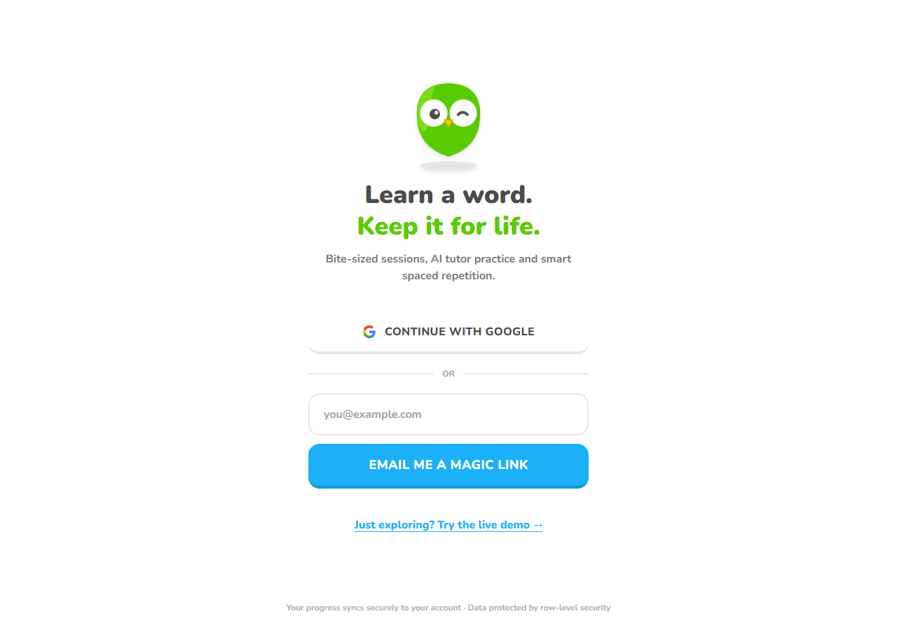
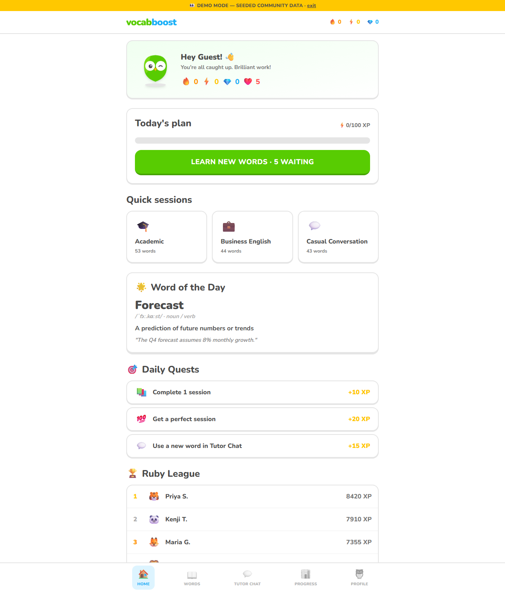

<div align="center">

# 🦉 VocabBoost

**The vocabulary trainer that gets words out of your head and into your conversations.**

Most apps teach you to *recognize* words. VocabBoost trains you to *use* them —
with spaced repetition timed to your forgetting curve and an AI tutor that grades
your actual sentences.

[Features](#-features) · [Quick Start](#-quick-start) · [How It Works](#-how-it-works) · [Roadmap](#-roadmap) · [Contributing](#-contributing)


</div>

---

## Why another vocabulary app?

Full-course apps spread thousands of concepts across dozens of skills — vocabulary
gets diluted. Dedicated flashcard apps drill recognition but never ask you to
*produce* a sentence. The result is familiar to every learner: you know the word
when you see it, but it never comes out when you need it.

VocabBoost closes that **active–passive vocabulary gap** by combining three things
that usually live in separate apps:

1. **Spaced repetition** (SM-2) that schedules each review right before you'd forget it
2. **Production practice** — sentence building, fill-in-the-blank, confusable-pair battles
3. **An AI tutor** that reads what you write, checks context and grammar, and pushes
   you to use your new words in conversation

## Screenshots

| Sign in | Daily dashboard |
| --- | --- |
|  |  |

Want to look around without an account? Open the app and hit **"Just exploring? Try
the live demo"** — or append `?demo=1` to any URL to browse with seeded community data.

## ✨ Features

- **Micro-sessions** — 6-question rounds mixing five exercise formats:
  meaning MCQs, reverse recall, fill-in-the-blank, audio listening, flashcards
- **⚔️ Discriminative review** — confusable pairs (*discreet/discrete*,
  *principal/principle*, *elicit/illicit*…) get head-to-head "word battle" drills,
  because mixed-up neighbours are why most reviews fail
- **SM-2 spaced repetition** — per-word ease factors, intervals and memory strength,
  with a visible strength bar on every word
- **AI tutor chat** — bring your own key from OpenRouter, Google Gemini, Groq or
  OpenAI; the tutor detects your learning words in your sentences and gives usage +
  grammar feedback. Works fully offline with a rules-based tutor too
- **Gamification that respects your time** — streaks, daily quests, XP, gems, hearts,
  leagues and badges; nothing gated behind paywalls
- **Word bank** — 140+ curated words across Academic (GRE/SAT), Business English and
  Casual Conversation, each with etymology, mnemonics (some Hinglish 😄), synonyms
  and antonyms
- **Real accounts** — sign in with Google or a magic link; progress syncs via Supabase
  Postgres locked down with row-level security
- **Multi-language UI** — English, Español, हिन्दी, Français, Deutsch
- **Demo mode** — one toggle switches between a seeded community view and the clean
  first-run experience

## 🚀 Quick Start

```bash
git clone https://github.com/BHARTIYAYASH/VOCABBOOST.git
cd VOCABBOOST
npm install
npm run dev
```

The app runs immediately with the built-in offline tutor. To enable cloud sync and
Google sign-in:

1. Create a free project at [supabase.com](https://supabase.com)
2. Run [`supabase/schema.sql`](supabase/schema.sql) in the SQL editor — it creates all
   tables, triggers and row-level-security policies
3. Copy `.env.example` → `.env` and fill in your project URL + anon key
4. *(Optional)* Enable the Google provider under Authentication → Providers

### Bring your own AI key

| Provider | Free tier | Get a key |
| --- | --- | --- |
| **OpenRouter** (default) | ✅ Llama 3.3 70B free | [openrouter.ai/keys](https://openrouter.ai/keys) |
| **Google Gemini** | ✅ Generous free tier | [aistudio.google.com/apikey](https://aistudio.google.com/apikey) |
| **Groq** | ✅ Fastest inference | [console.groq.com/keys](https://console.groq.com/keys) |
| **OpenAI** | Paid | [platform.openai.com](https://platform.openai.com/api-keys) |

Keys are stored **only in your browser** and sent only to the provider you chose.
No middleman server ever sees them.

## 🧠 How It Works

```
                    ┌─────────────────────────────┐
   new word ───────▶│  SM-2 scheduler              │
                    │  ease · interval · strength  │
                    └──────────┬──────────────────┘
                               │ due today?
             ┌─────────────────┼──────────────────┐
             ▼                 ▼                  ▼
      ┌────────────┐   ┌─────────────┐   ┌──────────────┐
      │  MCQ /     │   │ fill-in-    │   │ ⚔️ word battle│
      │  listening │   │ the-blank   │   │ (confusables)│
      └─────┬──────┘   └──────┬──────┘   └──────┬───────┘
            └─────────────────┼──────────────────┘
                              ▼
                  ┌───────────────────────┐
                  │  grade → reschedule    │
                  │  then prove it works:  │
                  │  use the word in AI    │
                  │  tutor chat            │
                  └───────────────────────┘
```

**Security model:** the anon key shipped with the client is public by design.
Every table enforces row-level security — users can only ever read/write their own
rows, and the leaderboard exposes nothing beyond display name and XP. API secrets
never enter the frontend bundle.

## Built With

- [React 18](https://react.dev) + [TypeScript](https://www.typescriptlang.org) (strict)
- [Vite](https://vitejs.dev)
- [Tailwind CSS](https://tailwindcss.com)
- [Supabase](https://supabase.com) — Postgres, Auth, RLS
- [OpenRouter](https://openrouter.ai) / Gemini / Groq / OpenAI — pluggable LLM layer

## 🗺️ Roadmap

- [ ] **Accent & pronunciation lab** — shadowing drills with scoring against native
      speaker audio, covering US / UK / Indian accents
- [ ] **Real-time voice conversations** — speak with the AI tutor instead of typing;
      live transcription, fluency pacing and pronunciation feedback
- [ ] FSRS scheduler as an alternative to SM-2
- [ ] Community-authored word packs
- [ ] More interface languages
- [ ] Mobile wrappers (Capacitor) with lock-screen review notifications

Contributions welcome — pick anything from the roadmap or open an issue with your idea.

## Contributing

```bash
git checkout -b feature/your-feature
git commit -m "add: your feature"
git push origin feature/your-feature
```

Then open a Pull Request. Keep PRs focused; if it changes scheduling behaviour,
include before/after numbers on a sample deck.

## License

[MIT](LICENSE) — free to use, modify and ship.
